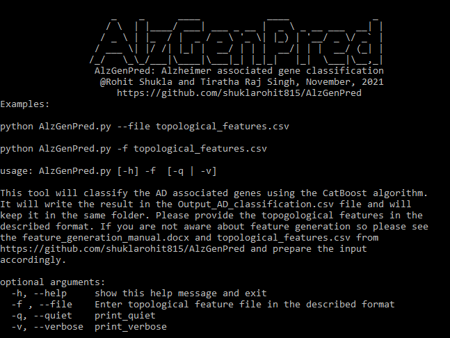

# AlzGenPred
AlzGenPred is a [CatBoost](https://catboost.ai/) based method developed by using network-based features. It can classify the Alzheimer's Disease (AD) associated genes with <b>96.55% accuracy and 98.99% AUROC</b>. AlzGenPred is developed as a standalone software package for the classification of AD genes. The method is tested on the [AlzGene](http://www.alzgene.org/) dataset and it outperformed with <b>96.43% accuracy</b>. The accuracy on the experimental data represents that the AlzGenPred can correctly classify the AD-associated genes. Additionaly, the AlzGenPred is also validated on the transcriptomics dataset. AlzGenPred is developed to provide the facility to the researcher to classify the AD genes out of thousands of the genes generated by multi-omics technologies. The small pool of genes out of thousands of genes predicted by AlzGenPred can be further used for research purpose.

# Dataset
The complete dataset used in training and testing the developed method can be downloaded from http://bioinfoindia.org/PMTPred/download.html

# Usage:

<h5>Download complete repository of AlzGenPred by git clone https://github.com/shuklarohit815/AlzGenPred </h5>

<h3> Dependencies </h3>

Before executing this program please install all the dependencies. This software requires the Python 3.0 or above to be install on your system. If you donot have Python in your system so please install the python by using this link https://www.python.org/downloads/. Then install the following dependencies by typing the below given command.

    $ pip install dependency_name

1. Pandas
2. Pickle
3. NumPy
4. Scikit-learn
5. CatBoost

After that invoke the tool with the below given command for detail help.

    $ python AlzGenPred.py -h

After successful installation of all the dependencies, execute the “AlzGenPred.py” script using the below given command from any terminal. The AlzGenPred.py and topological_features.csv are available in this repository.

        $ python AlzGenPred.py --file topological_features.csv
                                or
        $ python AlzGenPred.py -f topological_features.csv

If you are not aware about the feature generation (topological_features.csv) then please refer to the well documented tutorial (feature_generation_manual.pdf) given in the same repository.
